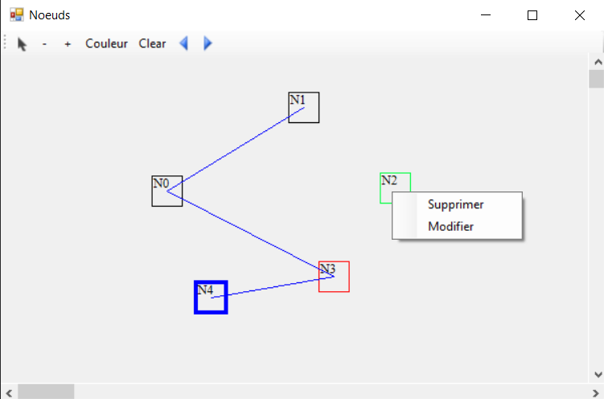

# Project C# Nodes

In this utility, you can:

- Use the left click to create a new node
- Right-click to delete or edit it
- Hold left click to create links between nodes
- Move a node by activating the "Mouse cursor" option in the top left
- Perform undo-redo actions with arrows
- Set color or thickness
- Zoom using CTRL + Wheel

Sample Image:

